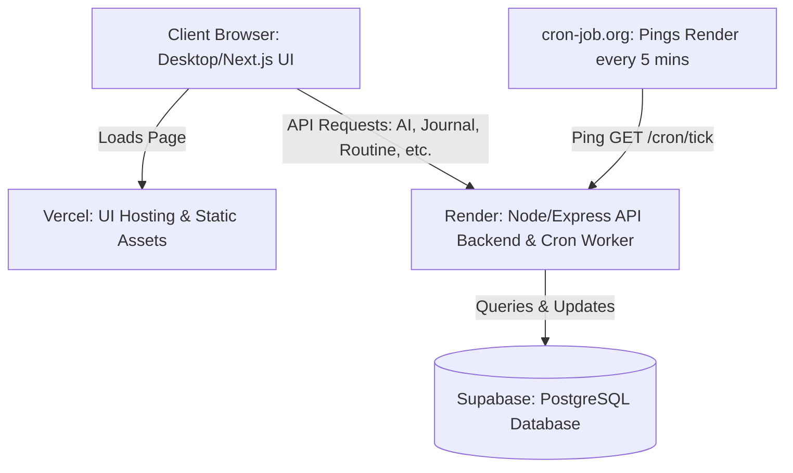

# Jujum AI - Personal PRD v3.1 (The Bible)
**Personal, Free, Simplified — Corrected Architecture**
**Date:** 2026-06-30

---

## Section 1 — Overview & Personal Scope

### 1.1 What This Is
This is the build-ready specification for **Jujum AI** — a personal, free, single-user web application that acts as a private AI mentor for GATE Mechanical + PSU preparation. It is scoped for a solo build, deployed on free tiers, and used daily for exam preparation. Every feature is designed to be buildable in a weekend or two.

### 1.2 Why Personal + Free Changes Everything
Building for a single user eliminates typical SaaS complexities:
* No complex auth system (no users table, no password recovery, no OAuth).
* No row-level security (RLS) or multi-tenant isolation.
* No compliance (GDPR/DPDP), cohort analytics, or penetration testing.
* Focus is 100% on the core daily loop, the AI mentor, and the learning modules.

The trade-off: The app does not scale, has no monetization, and relies on the creator for backups/uptime.

### 1.3 The Three Bets
* **Bet 1: The loop is the moat.** The modules are interconnected. The journal's `tomorrow_task` feeds the routine coach. The progress tracker's weak subjects drive the concept explainer. State is shared to build a unified mentor experience.
* **Bet 2: Honesty beats motivation.** The AI is not a cheerleader. It names missed exercises, points out distractions (e.g., phone usage), and issues direct comeback protocols without softening the feedback.
* **Bet 3: Hinglish is a feature.** Mentor feedback and explanations default to Hinglish (Hindi-English mix, Latin script), keeping technical terms, formulas, and subject names strictly in English.

### 1.4 What "Good" Means for a Solo Build
* **Fast load times:** Desktop dashboard loads under 2 seconds.
* **Data durability:** Journal entries, subject ratings, and interview attempts survive redeploys. Data is backed up weekly via JSON export.
* **Effective AI:** Guided by custom prompts and simple post-processing rather than complex evaluation pipelines.
* **Daily use:** The primary metric of success is consistent daily engagement.
* **₹0 cost:** Runs completely on free-tier hosting + a pluggable AI model.

### 1.5 Scope of the Project
* **In Scope:** The user daily loop, 5 core modules, a decoupled free-tier architecture, a lean data model, AI personality prompts, and a 3-phase build plan.
* **Out of Scope:** Multi-user accounts, multi-tenancy, compliance, complex evaluation harnesses, paid tiers, native mobile apps, voice input, past-year question (PYQ) databases, leaderboards, and community features.

---

## Section 2 — The User & The Loop

### 2.1 The User Persona
* Mechanical Engineering student / graduate preparing for GATE Mechanical / PSU.
* Struggles with study consistency (e.g., intense study for 3 days, followed by 10 days of inactivity).
* Needs clarity on which subjects are strong versus weak.
* Prefers an AI that references prior study patterns and avoids generic, generic advice.
* Primary viewport: **Desktop**.

### 2.2 The Daily-Weekly Loop
1. **Evening (Tonight):**
   * Write journal entry -> Save to Database -> Send to Render Backend -> AI generates 5-part mentor feedback and extracts exactly **one** `tomorrow_task`.
2. **Overnight (Render Cron):**
   * **04:00:** Finalize yesterday's score, update streaks, check comeback protocol (triggered if inactive for $\ge 3$ consecutive days).
   * **06:00:** Generate today's plan using `tomorrow_task` as priority, weak subjects, and available study hours.
3. **Morning (Wake):**
   * Dashboard displays: Greeting + today's tasks + yesterday's score + readiness percentage + weak areas + streaks.
   * Clicking the priority task (if concept revision) pre-fills the Concept Explainer.
4. **Midday (Study):**
   * Check off tasks (Completed / Partial / Not). Daily score updates live.
   * Concept Explainer topic status flows to the Progress Tracker, updating readiness metrics.
5. **Weekly (Sunday 20:00):**
   * AI generates a weekly report: average score, study hours, task stats, streak summary, biggest improvement/bottleneck, and advice for the upcoming week.
   * User reviews the report and updates subject ratings in the Progress Tracker.

### 2.3 The Five Modules
1. **Daily Accountability Journal (Evening):** Free-form entry with 5-part mentor feedback.
2. **AI Routine Coach (Morning + Overnight):** Generates daily plan, calculates daily scores, tracks streaks, and runs the comeback protocol.
3. **GATE Concept Explainer (Midday):** 6-part Hinglish explanation with practice questions.
4. **GATE Progress Tracker (Weekly):** 14-subject rating grid synthesized into a readiness percentage.
5. **Mock Interview & GD Prep (On-demand):** PSU company/mode selection with 5-dimension rubric scoring.

### 2.4 The Missed-Day Comeback Protocol
* **Trigger:** No app activity (no journals, no task completions) for $\ge 3$ consecutive days.
* **Day 3 Push Notification / Alert:** *"3 din se app use nahi hua... Aaj sirf 30 minutes ka minimum comeback session karo."*
* **On App Open:** Dashboard is replaced by **Comeback Mode** (displays exactly one 30-minute task and a single checkbox; no full plan, no scores, no streak shaming).
* **Completion within 24h:** Streaks stay at 0 (honest reset), but the "comeback secured" flag is set, returning the app to normal mode the next day.
* **Non-completion within 24h:** Day 5 notification shrinks the task to 10 minutes. Day 7 triggers a final honest warning, followed by a 7-day anti-spam silence.

---

## Section 3 — The Five Modules (Detailed Specs)

### 3.1 Module 1 — Daily Accountability Journal
* **Inputs:** Free-form entry (20–5000 characters), optional mood (1-5 emojis), optional tags (Study, Exercise, Reading, Sleep, Phone, Other).
* **AI Output (5 parts, separated by `---`):**
  1. *What went well today* (references specific student details).
  2. *What was missed* (plain, honest feedback).
  3. *Pattern (Conditional)* (identifies behaviors appearing in $\ge 2$ of the last 7 entries).
  4. *Tomorrow's priority task* (format: `[Action] [subject/topic] [duration] [trigger]`).
  5. *Closing line* (short, honest, non-cheerleading mentor advice).
* **Acceptance Criteria:** Max 250 words total. Mentions user by name at least once. Out-of-bounds inputs or failures save the entry and trigger a friendly Hinglish error message with a background retry.
* **Hooks:** Feeds `tomorrow_task` directly to the Routine Coach.

### 3.2 Module 2 — AI Routine Coach
* **Inputs:** Yesterday's `tomorrow_task`, current weak subjects, weekly progress summary, available hours, missed tasks ($\le 2$ days old), personal habits, weekend flag.
* **Morning Plan Format:** Greeting with streak count -> 3-6 tasks (at least one targeting a weak subject) -> main priority (non-negotiable) -> carry-over notes. Max 200 words. Total task duration $\le \text{available\_hours} \times 60 \times 1.1$.
* **Daily Score (/100):** Default weights (Study: 60, Exercise: 15, Reading: 10, Routine: 15). Completed = 100%, Partial = 50%, Not = 0%. Comment bands based on score:
  * $\ge 75$: *"Sahi din tha."*
  * $50\text{--}74$: *"Theek din, par priority miss hui."*
  * $< 50$: *"Aaj weak gaya. Kal comeback."*
* **Streaks:** Journal, Study, Exercise, and Full-routine streaks (score $\ge 60$). Resets to 0 on zero-activity days.

### 3.3 Module 3 — GATE Concept Explainer
* **Inputs:** Topic text (2–100 chars), optional skip-basics toggle, optional difficulty hint.
* **AI Output (6 parts):**
  1. *Simple definition* (2-3 sentences, or 1 if skip-basics is enabled).
  2. *Real-life example* (omit if skip-basics is enabled).
  3. *Important formulas* (1-3 formulas with variable glossary; strictly no hallucinations).
  4. *GATE relevance*.
  5. *Common mistakes*.
  6. *Practice questions* (exactly 2-3 interactive questions, presented one-by-one).
* **Acceptance Criteria:** Parts 1-5 $\le 600$ words. Default language: Hinglish.
* **Hooks:** Writes topic completion status to the Progress Tracker.

### 3.4 Module 4 — GATE Progress Tracker
* **14 Subjects with Weightages:** See Section 5.3.
* **Weekly Inputs per Subject:** `self_rating` (1–5, required), `hours_studied`, `questions_solved`, `confidence_level` (1–5), `revision_status`, `notes`.
* **AI Analysis (7 sections):** Weak subjects ($\le 2$), strong subjects ($\ge 4$), neglected subjects (no updates for $\ge 3$ weeks), recommended next topics, weekly study plan, readiness percentage, and avoidance warnings (if a high-weightage subject has a rating of $\le 2$ for $\ge 2$ consecutive weeks). Max 400 words.

### 3.5 Module 5 — Mock Interview & GD Prep
* **Inputs:** PSU company (BHEL, ONGC, IOCL, NTPC, HPCL, BPCL, GAIL, SAIL, DRDO, ISRO, Other), mode (Technical, HR, Mixed, GD, Rapid Fire), text responses.
* **Output per Answer:** Score /10, 5-dimension breakdown (0–2 points each), 1–3 missing points, and an improved example answer (max 300 words).
* **Session Flow:** 5 questions default, served one-by-one. Evaluation $\le 15$ seconds. Ends with a total score + summary feedback. Rapid Fire mode features a 5-minute timer (10 questions, 30s per question auto-advance).

---

## Section 4 — Architecture & Free Stack

### 4.1 Architecture Principles
1. **Decoupled Stack:** Vercel hosts the Next.js frontend UI. Render hosts a persistent Node/Express API backend. All heavy operations, database writes, and AI calls are routed through Render to bypass Vercel's 10-second Serverless timeout.
2. **Persistent Backend:** Render runs as a free web service. To keep the instance awake and prevent sleeping, **cron-job.org pings Render every 5 minutes**.
3. **Database:** Both frontend and backend communicate directly with a shared Supabase PostgreSQL database.
4. **Passcode Security:** An `APP_PASSCODE` cookie gate (`iron-session`, 7-day expiry) secures all API endpoints and pages.

### 4.2 The Free Stack
* **Frontend UI:** Next.js 15 on Vercel Hobby (100 GB bandwidth).
* **Backend API / Cron Logic:** Node/Express on Render Free Web Service (750 instance hours/month, kept awake via 5-min pings).
* **Database:** Supabase Free Tier (500 MB Postgres).
* **State Management & Forms:** React Hook Form + Zod.
* **Email (Backups):** Resend Free Tier (3,000 emails/month).
* **Pinger:** cron-job.org (hitting Render `/cron/tick` every 5 minutes to maintain hot state).

---

## Section 5 — Data Model (Lean)

### 5.1 Key Tables
1. `settings` (1 row): App preferences, available hours, target scores.
2. `subjects` (14 rows, static): Reference list of GATE ME subjects.
3. `journals` (one/day): Entry logs, AI feedback, extracted tasks.
4. `routine_plans` (one/day): Core plan, scores, streaks.
5. `tasks` (per-day tasks): Priority status, duration, type, and execution status.
6. `progress_ratings` (per subject/week): User self-ratings, study stats.
7. `topic_status` (per topic): Tracker for topics completed via Explainer.
8. `concept_explanations`: Logs of concept explanations generated.
9. `interview_attempts`: Logged sessions for Mock Interviews.
10. `ai_call_logs`: Performance logs (latencies, success rates).

### 5.2 The 14 GATE ME Subjects (Weightage)
1. Engineering Mathematics (0.14)
2. Engineering Mechanics (0.06)
3. Strength of Materials (0.09)
4. Theory of Machines (0.09)
5. Machine Design (0.06)
6. Fluid Mechanics (0.09)
7. Heat Transfer (0.06)
8. Thermodynamics (0.11)
9. Power Plant Engineering (0.05)
10. Refrigeration & Air Conditioning (0.05)
11. Internal Combustion Engines (0.05)
12. Manufacturing Engineering (0.14)
13. Industrial Engineering (0.06)
14. General Aptitude (0.15)

---

## Section 6 — AI Layer & Personality Specification

### 6.1 Personality Preamble (`prompts/_preamble.md`)
You are Jujum AI — a personal, supportive but honest mentor for a Mechanical Engineering student preparing for GATE and PSUs. 

* **Tone:** Mentor-like, practical, and direct. Slightly strict when needed. Do not command, threaten, or offer cheap cheerleading.
* **Register:** Default to simple Hinglish (Hindi-English mix, Latin script). Keep technical terms, formulas, and subjects strictly in English.
* **Forbidden Behaviors:**
  * Generic motivation (*"you got this"*, *"believe in yourself"*).
  * Shaming language (*"pathetic"*, *"disappointing"*).
  * Hallucinating context or facts not present in state injection.
  * Creating fake or unverified formulas.
* **Always:** Reference the student by name (`{{user_name}}`) at least once, and stay specific to subjects, hours, and behaviors.

---

## Section 7 — Build Plan (Solo, 3 Phases)

### 7.1 Phase 1 — Foundation + Daily Loop (Weeks 1-4)
* **Week 1:** Setup Next.js UI, Render backend skeleton, database setup (Prisma migrations), passcode gate, and mock AI adapter.
* **Week 2:** Journal submission pages (Vercel) + API route validation, AI feedback integration, and database persistence (Render).
* **Week 3:** Routine Coach pages, morning plan generation (Render), scoring logic, streak calculations, and dashboard UI wiring.
* **Week 4:** Edge cases, empty states, and testing the end-to-end daily loop. Verify 5 out of 7 days of real usage.

### 7.2 Phase 2 — Concept Explainer + Progress Tracker (Weeks 5-6)
* **Week 5:** Concept Explainer interface, topic normalization, explanation parser, and interactive practice question flow.
* **Week 6:** 14-subject Progress Tracker grid, weekly rating inputs, readiness calculation, and avoidance alert banners.

### 7.3 Phase 3 — Mock Interview + Polish + Backup (Weeks 7-8)
* **Week 7:** PSU Mock Interview flow (company selector, question display, text responses, rubric scoring, timer). Add weekly JSON backup emails via Resend.
* **Week 8:** Final prompt polishing, desktop responsive pass, empty state optimization, and system latency checks.
