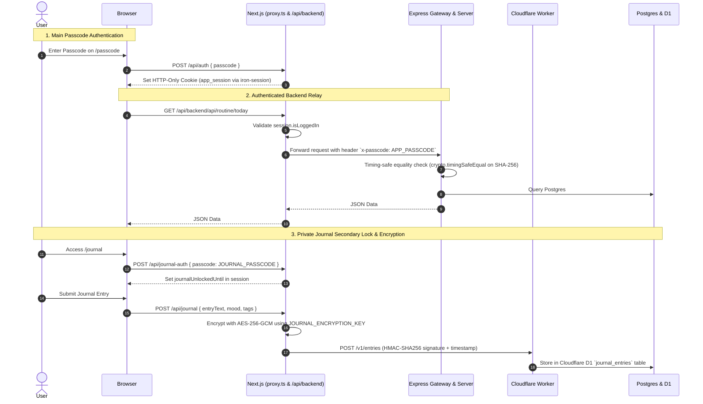
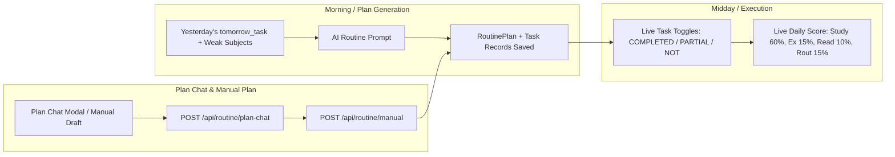

# DOOR / Jujum AI — Master Codebase Architecture & Code Flow Guide

> **Single Source of Truth** for the entire DOOR (Jujum AI) repository: system topology, data flow, security model, module lifecycles, database schema, AI orchestration, and operational commands.

---

## 1. System Topology & Architecture

DOOR (Jujum AI) is an all-in-one personal AI study copilot and life operating system tailored for GATE Mechanical + PSU exam preparation and student hostel finance. It is built as a single-user system deployed across free-tier hosting platforms with zero maintenance cost.

```mermaid
graph TD
    subgraph Clients
        Browser[Desktop / Mobile Browser]
        MobileApp[Expo React Native App]
    end

    subgraph Vercel Hosting
        NextUI[Next.js 16 App Router\nPort 3000]
        SessionGate[iron-session Gate\napp_session Cookie]
        NextRelay[API Relay Proxy\n/api/backend/[...path]]
    end

    subgraph Render Hosting
        Gateway[Express Gateway\nPort 4000\nCORS + Interview Session Cache]
        CoreServer[Express Core API\nPort 4001\nAuth, Business Logic, AI Engine]
    end

    subgraph Cloudflare
        CFWorker[Cloudflare Worker\nHMAC-SHA256 Auth]
        D1[(Cloudflare D1 SQLite)]
    end

    subgraph Database
        Postgres[(Supabase PostgreSQL\nPrisma ORM)]
    end

    subgraph AI Providers
        OpenRouter[OpenRouter API]
        Nvidia[NVIDIA NIM API]
        Cerebras[Cerebras API]
    end

    Browser -->|Loads UI| NextUI
    Browser -->|/api/backend/*| SessionGate --> NextRelay
    NextRelay -->|x-passcode: APP_PASSCODE| Gateway
    MobileApp -->|Direct API + x-passcode| Gateway

    Gateway -->|Interview eval/skip| Gateway
    Gateway -->|All other traffic| CoreServer

    CoreServer -->|Prisma queries / mutations| Postgres
    CoreServer -->|AES-GCM encrypted journal| CFWorker --> D1
    CoreServer -->|Mirrored StudyLogs & Weekly Snapshots| CFWorker
    CoreServer -->|LLM Prompts & Structured JSON| OpenRouter
    CoreServer --> Nvidia
    CoreServer --> Cerebras
```

### Physical Surfaces & Deployables

| Surface | Path | Tech Stack | Host / Port | Responsibility |
|---|---|---|---|---|
| **Frontend** | `frontend/` | Next.js 16 (React 19, Tailwind v4, Motion, Lucide/SVG, KaTeX) | Vercel (`:3000` dev) | Web UI, client state, authenticated `/api/backend` proxy relay, Demo mode |
| **Backend Gateway** | `backend/src/gateway.ts` | Express, TypeScript | Render (`:4000`) | External entrypoint: CORS, interview evaluators, session state, proxies to port 4001 |
| **Backend Core** | `backend/src/server.ts` | Express, TypeScript, Prisma | Render (`:4001` internal) | Core API, routine coach, tracker, explainer, finance, AI orchestration, cron worker |
| **Mobile App** | `mobile/` | Expo 54, React Native 0.81, React 19, React Query | iOS/Android (`:8081` Metro) | Native mobile client communicating directly with Express backend |
| **Cloudflare Store** | `cloudflare/journal-store/` | Cloudflare Worker + D1 | Cloudflare Edge | Private journal (AES-256-GCM ciphertext), secondary StudyLog mirror, DB backups |
| **Primary Database** | `prisma/` | PostgreSQL (Supabase) via Prisma 5 | Cloud Postgres | Settings, subjects, tasks, routine plans, progress ratings, finance, AI keys |

---

## 2. Authentication & Security Model

The system enforces a **Defense-in-Depth** single-user security model:



### Key Security Invariants
1. **Passcode Gate (`APP_PASSCODE`)**:
   - Minimum 8 characters.
   - Verified on Express via SHA-256 hash using `crypto.timingSafeEqual` (`backend/src/lib/auth.ts`).
   - Brute-force brake: 10 failed attempts triggers a 5-minute cooldown (`authFailureLimiter`).
   - Rate limit: 300 requests/minute global cap (`apiCapLimiter`), 30 requests/minute for AI surfaces (`aiSpendLimiter`).
2. **Web Relay Isolation**:
   - The browser never receives `APP_PASSCODE`. The browser only holds the encrypted `app_session` cookie.
   - The Next.js server relay (`frontend/app/api/backend/[...path]/route.ts`) verifies the session and appends `x-passcode`.
3. **Mobile Secure Store**:
   - Mobile stores passcode in `expo-secure-store` via `securePasscode.set(passcode)`.
   - Directly calls backend with `x-passcode` header.
4. **Encrypted Private Journal**:
   - Requires secondary unlock (`JOURNAL_PASSCODE` or fallback to `APP_PASSCODE`).
   - Unlocked state stored with a TTL (`journalUnlockedUntil`, default 4 hours).
   - Plaintext never reaches Supabase Postgres. Content is encrypted using `AES-256-GCM` with `JOURNAL_ENCRYPTION_KEY` on the server before dispatching to Cloudflare D1.
   - Requests between Express/Next.js and Cloudflare Worker are signed with HMAC-SHA256 (`X-Journal-Timestamp`, `X-Journal-Signature`, `CF_JOURNAL_STORE_SECRET`).

---

## 3. Directory Layout & Module Map

```
d:\DOOR\
├── .agents\                   # Agent configuration & loaded skills
│   ├── AGENTS.md             # Global repository agent rules
│   └── skills\               # Special skills (campus-finance-management, godaudits)
├── backend\                  # Express backend & cron worker
│   ├── prisma\               # Prisma schema copy & migrations
│   ├── prompts\              # Markdown system prompts for LLMs
│   │   ├── _preamble.md      # Jujum AI personality & Hinglish tone guidelines
│   │   ├── routine_plan.md   # Morning routine generation prompt
│   │   ├── journal.md        # 5-part evening feedback prompt
│   │   ├── explainer.md      # GATE mechanical concept explainer prompt
│   │   ├── plan_chat.md      # Interactive task planning chat prompt
│   │   ├── general_chat.md   # General mentor chat prompt
│   │   └── tracker_analysis.md # Weekly 7-section readiness analysis prompt
│   ├── src\
│   │   ├── gateway.ts        # External port 4000: CORS, interview eval & proxy
│   │   ├── server.ts         # Internal port 4001: Core Express application
│   │   ├── seed.ts           # DB seeder (14 GATE subjects & default settings)
│   │   └── lib\
│   │       ├── auth.ts       # Shared secret & timing-safe equality
│   │       ├── billing.ts    # Transactional bill payment & ledger sync
│   │       ├── logger.ts     # Operational logging
│   │       ├── rate-limit.ts # Sliding window in-memory rate limiter
│   │       ├── time.ts       # Asia/Kolkata timezone calculations
│   │       ├── backup-store.ts # DB backup serialization
│   │       ├── private-journal-store.ts # AES-GCM encryption & D1 journal client
│   │       ├── private-tracker-store.ts # D1 secondary study log client
│   │       └── ai\
│   │           ├── credentials.ts # Encrypted API key storage in Postgres
│   │           └── provider.ts    # OpenAI-compatible provider (OpenRouter/NVIDIA/Cerebras)
│   └── test\                 # Node test suite (auth, billing, time, etc.)
├── cloudflare\               # Cloudflare Workers & D1 storage
│   └── journal-store\
│       ├── wrangler.toml     # D1 database binding
│       ├── migrations\       # SQLite D1 migrations (journal, tracker logs, backups)
│       └── src\index.ts      # Cloudflare Worker API with HMAC auth
├── frontend\                 # Next.js 16 Web Application
│   ├── app\
│   │   ├── proxy.ts          # Route middleware (auth redirect, demo mode)
│   │   ├── layout.tsx        # Root HTML, fonts, AppShell wrapper
│   │   ├── passcode\         # Login & demo mode entry
│   │   ├── dashboard\        # Daily Routine Coach & Today's Plan
│   │   ├── journal\          # Evening Accountability Journal & Unlock
│   │   ├── tracker\          # 14-Subject GATE ME Progress Tracker & Logs
│   │   ├── explainer\        # Concept Explainer & Formula Practice
│   │   ├── interview\        # PSU Mock Interview & GD Prep
│   │   ├── finance\          # Campus Cashflow Personal Finance
│   │   ├── chat\             # AI Mentor Chat
│   │   ├── settings\ai\      # AI Provider & Model Management
│   │   └── api\
│   │       ├── auth\         # Passcode verification & session cookie
│   │       ├── backend\      # Authenticated upstream proxy to Express
│   │       ├── journal\      # Encrypted journal read/write
│   │       └── journal-auth\ # Journal-specific secondary unlock
│   ├── components\           # React components (AppShell, Motion, Latex, Modals)
│   └── lib\                  # Session, env, demo mode, cache
├── mobile\                   # Expo React Native App
│   ├── app\
│   │   ├── _layout.tsx       # Root stack navigator & ThemeProvider
│   │   ├── passcode.tsx      # Mobile passcode entry screen
│   │   └── (tabs)\           # Tab navigator: Today, Study, Finance, Profile
│   └── src\
│       ├── services\api.ts   # Typed API client hitting Express backend
│       └── services\secure-store.ts # SecureStore passcode storage
├── prisma\                   # Root Prisma configuration
│   └── schema.prisma         # Supabase Postgres schema
├── docs\                     # Project documentation & runbooks
│   ├── RESTORE.md            # Database snapshot restore runbook
│   └── CODEBASE_GUIDE.md     # This master document
└── scripts\                  # Operational utilities (backup fetch & restore)
```

---

## 4. Database Schema (Postgres & Cloudflare D1)

### 4.1 Supabase PostgreSQL Models (`prisma/schema.prisma`)

1. **`Settings`**:
   - `id` (`"default"`), `name`, `targetExam` (`"GATE"`), `targetYear` (`2026`), `dailyAvailableHours` (e.g. `4.0`), `preferredLanguage` (`"hinglish"`), `timezone` (`"Asia/Kolkata"`), `wakeTime`, `sleepTime`, `exerciseGoal`, `prepLevel`, `scoreWeights` (JSON: study/exercise/reading/routine), `weeklyAnalysis`, `analysisStale`.
2. **`Subject`** (14 seeded GATE ME subjects):
   - `subjectId`, `subjectName`, `importanceLevel` (weightage e.g. 0.14), `topics` (JSON list).
3. **`RoutinePlan`**:
   - `planId`, `date` (`@db.Date @unique`), `greeting`, `planText`, `mainPriority`, `totalEstimatedMin`, `isWeekend`, `generatedAt`.
4. **`Task`**:
   - `taskId`, `date`, `planId` (`RoutinePlan`), `title`, `taskType` (`study` | `exercise` | `reading` | `routine`), `subjectId`, `durationMin`, `status` (`NOT` | `PARTIAL` | `COMPLETED`), `isPriority`, `isCarryover`.
5. **`ProgressRating`**:
   - `ratingId`, `subjectId`, `weekStartDate` (`@db.Date`), `selfRating` (1-5), `hoursStudied`, `questionsSolved`, `confidenceLevel` (1-5), `revisionStatus`, `notes`, `aiRecommendation`. `@@unique([subjectId, weekStartDate])`.
6. **`StudyLog`**:
   - `id`, `logDate` (`YYYY-MM-DD`), `timeBlock` (`Morning` | `Evening`), `subjectId`, `subjectName`, `hoursStudied`, `questionsSolved`, `notes`. Primary durable study log store.
7. **`TopicStatus`**:
   - `topicStatusId`, `subjectId`, `topicId`, `status` (`NOT_STARTED` | `IN_PROGRESS` | `COMPLETED`), `lastExplanationId`, `lastScore`.
8. **`WeeklyReport`**:
   - `reportId`, `weekStartDate` (`@db.Date @unique`), `avgDailyScore`, `totalStudyHours`, `completedTasks`, `missedTasks`, `streaksSummary`, `biggestImprovement`, `biggestProblem`, `aiSummary`.
9. **`AiProviderCredential`**:
   - `provider` (`openrouter` | `nvidia` | `cerebras`), `encryptedApiKey`, `encryptionIv`, `authTag`, `keyHint`, `model`, `isActive`.
10. **`FinanceExpense`**:
    - `id`, `title`, `category`, `amount` (`Decimal(12,2)`), `date` (`YYYY-MM-DD`), `payment` (`UPI` | `Cash` | `Card`).
11. **`FinanceBudget`**:
    - `id` (`"default"`), `allowance` (`Decimal(12,2)`), `caps` (JSON: map of category -> monthly cap).
12. **`FinanceBill`**:
    - `id`, `title`, `date` (`YYYY-MM-DD`), `amount` (`Decimal(12,2)`), `category`, `paid` (Boolean).

### 4.2 Cloudflare D1 SQLite Models (`cloudflare/journal-store/migrations/`)

1. **`journal_entries`**:
   - `id` (TEXT PRIMARY KEY), `entry_date` (TEXT UNIQUE, `YYYY-MM-DD`), `ciphertext` (TEXT: AES-256-GCM encrypted payload containing `entryText`, `mood`, `tags`, `aiFeedback`, `tomorrowTask`, `patternDetected`, `studyDone`, etc.), `created_at` (INTEGER), `edited_at` (INTEGER).
2. **`tracker_study_logs`**:
   - Secondary mirror for `StudyLog` entries (`id`, `log_date`, `time_block`, `subject_id`, `subject_name`, `hours_studied`, `questions_solved`, `notes`, `created_at`).
3. **`backups`**:
   - Full weekly JSON snapshot of all Postgres tables (`id` e.g. `full-2026-09-07`, `kind` = `"full"`, `week_of`, `created_at`, `payload` string).

---

## 5. End-to-End Module Code Flows

### 5.1 Daily Routine Coach (`/dashboard`)



- **Plan Generation**:
  - `POST /api/routine/manual`: Accepts normalized task list (1-30 tasks, 5-480 mins each). Replaces today's plan and tasks in an atomic transaction.
  - `POST /api/routine/plan-chat`: Conversational task drafting with AI. Retains manual draft tasks, suggests alterations, and extracts durations (`plan_chat.md`).
- **Task Status Toggles**:
  - `PATCH /api/routine/tasks/:taskId`: Updates status (`NOT`, `PARTIAL`, `COMPLETED`) or duration.
  - Updates live daily score: `Study` (weight 60), `Exercise` (15), `Reading` (10), `Routine` (15).
  - Feedback bands: $\ge 75$ (*"Sahi din tha."*), $50\text{--}74$ (*"Theek din, par priority miss hui."*), $<50$ (*"Aaj weak gaya. Kal comeback."*).
- **Comeback Protocol**:
  - Triggered if $\ge 3$ consecutive inactive days.
  - Hides full plan; shows a single 30-minute comeback task to restore habit momentum without shame.

### 5.2 Daily Accountability Journal (`/journal`)

- **Evening Reflection Flow**:
  1. User fills 20–5000 character reflection, mood (1–5), and tags (`Study`, `Exercise`, `Reading`, `Sleep`, `Phone`, `Other`).
  2. Frontend sends to `POST /api/journal`.
  3. Server encrypts with `AES-256-GCM` using `JOURNAL_ENCRYPTION_KEY` and persists to Cloudflare D1 immediately (ensuring draft safety).
  4. AI mentor analyzes the entry (`journal.md` + `_preamble.md`):
     - **Part 1**: What went well today.
     - **Part 2**: What was missed (honest critique).
     - **Part 3**: Pattern detected (recurrent habits in $\ge 2$ of last 7 entries).
     - **Part 4**: Tomorrow's priority task (formatted: `[Action] [subject/topic] [duration] [trigger]`).
     - **Part 5**: Short closing line.
  5. The extracted `tomorrowTask` is saved with the encrypted entry and becomes the seed for the next day's Routine Coach.

### 5.3 GATE Progress Tracker (`/tracker`)

- **14 GATE ME Subjects & Weightages**:
  1. General Aptitude (0.15)
  2. Engineering Mathematics (0.14)
  3. Manufacturing Engineering (0.14)
  4. Thermodynamics (0.11)
  5. Strength of Materials (0.09)
  6. Theory of Machines (0.09)
  7. Fluid Mechanics (0.09)
  8. Heat Transfer (0.06)
  9. Machine Design (0.06)
  10. Industrial Engineering (0.06)
  11. Engineering Mechanics (0.06)
  12. Power Plant Engineering (0.05)
  13. RAC (0.05)
  14. IC Engines (0.05)
- **Study Logging (`POST /api/tracker/log`)**:
  - Increments weekly `ProgressRating` cumulative hours and questions.
  - Creates a primary `StudyLog` record in Supabase Postgres.
  - Asynchronously mirrors the log to Cloudflare D1.
- **Weekly Rating (`POST /api/tracker/rating`)**:
  - User rates subject (1-5), confidence level (1-5), revision status.
  - Updates `overallReadiness` calculation: $\sum (\text{rating}_i / 5) \times \text{weight}_i$.
  - Flags avoidance warnings: High-weightage subject rated $\le 2$ for $\ge 2$ consecutive weeks.

### 5.4 GATE Concept Explainer (`/explainer`)

- **Flow**:
  1. Student enters topic/concept, optional subject, difficulty, or attaches an engineering diagram/formula image.
  2. Route: `POST /api/explainer/query` or `/api/explainer/explain`.
  3. Uses `explainer.md` system prompt. Supports multimodal vision input via `image_url`.
  4. Delivers 6-part Hinglish explanation:
     - Definition & intuitive concept.
     - Real-life engineering analogy.
     - Governing formulas rendered in KaTeX.
     - GATE exam weightage and trap areas.
     - Common conceptual mistakes.
     - 2–3 interactive practice questions with step-by-step verification.
  5. Syncs topic completion into `TopicStatus` table.

### 5.5 Mock Interview & GD Prep (`/interview`)

- **Gateway-Managed Flow (`backend/src/gateway.ts`)**:
  - Companies: BHEL, ONGC, IOCL, NTPC, HPCL, BPCL, GAIL, SAIL, DRDO, ISRO, Other.
  - Modes: `Technical`, `HR`, `Mixed`, `GD`, `Rapid Fire` (30s auto-advancing timer).
  - Evaluation: Evaluates answers against 5 domain rubrics (0 to 2 points each, max 10):
    - Technical: *Correctness, Structure, Clarity, Completeness, Confidence*.
    - HR: *Relevance, Honesty, Confidence, STAR structure, Professional tone*.
    - GD: *Argument quality, Balance, Evidence, Clarity, Group awareness*.
  - In-memory `sessionStore` tracks questions 0..N, calculates cumulative average score, and returns `sessionSummary`.

### 5.6 Campus Cashflow Personal Finance (`/finance`)

- **Hosted under `frontend/app/finance/page.tsx` & Skill `campus-finance-management`**:
  - Currency: Indian Rupee (`₹`, `en-IN` formatting).
  - Allowance & Daily Runway: Computes `Math.floor(remaining / daysRemainingInMonth)`.
  - Category Envelopes: Hostel & utilities, Food & mess, Travel & commute, Academics, Personal & health, Subscriptions, Fun & social.
  - **Atomic Bill Payment**:
    - `POST /api/finance/bill/pay` calls `payBillById` (`backend/src/lib/billing.ts`).
    - Inside a single Prisma `$transaction`: Marks `FinanceBill.paid = true` and creates an auto-linked `FinanceExpense` (`id: bill-${id}`, `payment: "UPI"`).

---

## 6. AI Orchestration Layer

### 6.1 Provider Flexibility (`backend/src/lib/ai/`)
- Unified interface `AiProvider` with implementation `OpenAICompatibleProvider`.
- Supported Providers:
  1. **OpenRouter** (`https://openrouter.ai/api/v1`)
  2. **NVIDIA NIM** (`https://integrate.api.nvidia.com/v1`)
  3. **Cerebras** (`https://api.cerebras.ai/v1`)
- Credentials stored encrypted in Postgres `AiProviderCredential` using AES-256-GCM.
- Managed and tested via `/settings/ai` (`GET/POST /api/ai/config`, `POST /api/ai/test`).

### 6.2 Prompt Engineering & Personality Preamble
- All prompts load `prompts/_preamble.md` + specific template.
- Personality:
  - **Tone**: Mentor-like, practical, direct, zero fluff, zero fake cheerleading.
  - **Language**: Hinglish (Hindi-English mix in Latin script) with all technical terms, formulas, and subjects in pure English.
  - **Robustness**: Parsed with `jsonrepair` to tolerate markdown wrappers and trailing commas; includes automatic fallback retries with stricter formatting constraints.

---

## 7. Cron & Operational Runbook

### 7.1 Cron Tick (`/cron/tick`)
- Kept awake on Render via external pings from `cron-job.org` every 5 minutes.
- Secured via header: `x-cron-secret: CRON_SHARED_SECRET`.
- Scheduled Actions (IST Timezone):
  - **04:00 IST**: Finalizes yesterday's score, updates habit streaks, evaluates missed-day comeback conditions.
  - **Mondays 04:00 IST**: Triggers `pushBackup(prisma)` — serializes all Postgres tables to JSON and uploads to Cloudflare D1 `backups` table (`full-YYYY-MM-DD`).

### 7.2 Developer Commands

```bash
# === BACKEND (Express on :4000 gateway, :4001 core) ===
cd backend
npm install
npm run prisma:generate
npm run dev           # Runs nodemon with ts-node
npm test              # Runs node --test suite

# === FRONTEND (Next.js 16 on :3000) ===
cd frontend
npm install
npm run dev           # Runs Next.js development server
npm run build         # Production build check

# === MOBILE (Expo React Native on :8081) ===
cd mobile
npm install
npx expo start        # Starts Metro bundler
# Or use root launcher: run_mobile.bat

# === DATABASE & DISASTER RECOVERY ===
npx prisma studio     # Visual database browser
node scripts/backup-fetch.mjs > backup.json # Export latest snapshot from D1
node scripts/backup-restore.mjs backup.json  # Restore into Postgres
```

### 7.3 Critical Invariants for Developers & AI Agents
1. **Never edit Dark Mode styles** (`data-theme="dark"`) unless explicitly instructed by the user.
2. **Never store plaintext journal records in Postgres**. The `Journal` table in Postgres is retired; all entries must flow through `private-journal-store.ts` into Cloudflare D1 with AES-256-GCM encryption.
3. **Always use Asia/Kolkata timezone** (`getKolkataDate`, `getKolkataDateString` from `lib/time.ts`) for any scheduling, streak math, or date keys.
4. **Always wrap bill payment in atomic transaction**: Marking a bill paid must produce the linked `bill-${id}` expense in the same transaction.
5. **Protect the AI wallet**: Rate-limit AI endpoints (`allowAiSpend`), use reasonable `max_tokens`, and keep prompt histories truncated to safe window sizes.
